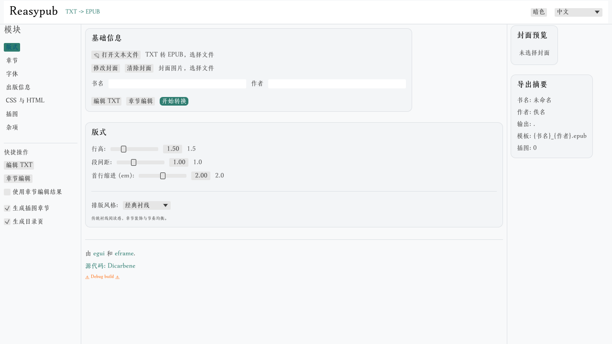
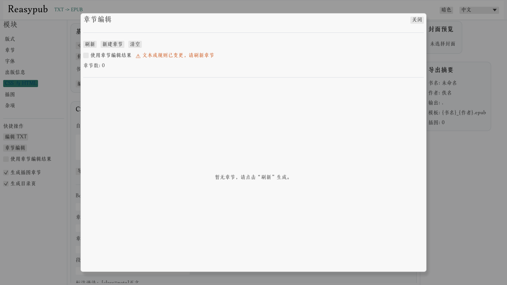

# Reasypub

[](https://github.com/Dicarbene/reasypub/actions/workflows/rust.yml)
[](https://deps.rs/repo/github/Dicarbene/reasypub)

Reasypub 是一款将 TXT 文本转换为 EPUB 的桌面应用，提供分章识别、章节编辑、封面/字体/样式配置、插图管理等功能，支持中英双语界面与明暗主题。

Reasypub is a desktop app that converts TXT files into EPUB, with chapter splitting, chapter editing, cover/font/style customization, illustration management, bilingual UI, and light/dark themes.

## Version Lifecycle

- Current milestone: `0.95.0`.
- `0.95.0` goal: stabilize TOC configuration and conversion quality in desktop + web builds.
- `1.0.0` gate: all automated checks green, no open P0/P1 issues, and manual regression passed.
- Release governance docs:
  - `CHANGELOG.md`
  - `SUPPORT_MATRIX.md`
  - `RELEASE_CHECKLIST.md`

---

## 主要特性 / Key Features

### 1) 转换与分章 / Conversion & Chapter Split
- **TXT → EPUB** 一键转换 / One-click TXT → EPUB
- **分章方式** / Split methods:
  - **Regex（正则）**：输入自定义正则表达式 / Enter custom regex
  - **Custom Config（从文件加载）**：读取正则配置文件 / Load regex from file
  - **Simple Rules（简易规则）**：基于章节标题启发式 / Heuristic title splitting
- **内置中文规则**：正则为空时使用内置中文章节识别 / Built-in CN rule if regex is empty
- **章节预览**：在转换前查看章节数量与标题 / Preview chapter count and titles

### 2) 章节编辑 / Chapter Editor
- 打开章节编辑器查看与编辑章节 / Open editor to edit chapters
- 支持章节增删、排序、标题与内容编辑 / Add/remove/reorder/edit
- 章节可上移/下移、删除、清空 / Move up/down, delete, clear all
- 文本或规则变更后提示“过期”/ Shows “stale” when source changes
- 章节编辑结果可直接用于转换 / Use edited chapters for conversion

### 3) 文本编辑 / Text Editor
- 内置 TXT 编辑器，可直接编辑源文件 / Built-in TXT editor for quick edits
- 保存会写回原文件 / Save writes back to the source file

### 4) 书籍信息 / Book Metadata
- 书名、作者、语言、出版社、ISBN、分类、出版日期、简介
- 未填写时自动使用占位（如未命名/佚名）/ Falls back to placeholders

### 5) 封面与插图 / Cover & Illustrations
- 选择封面图片（jpg/png/webp）/ Choose cover image
- 封面大小限制：>10MB 提示过大 / Cover size limit >10MB
- 插图管理：单张添加/批量导入 / Add single or batch import
- 插图可填写说明（caption）/ Optional captions for images
- 可生成插图章节 / Generate illustration gallery chapter

### 6) 排版与字体 / Layout & Fonts
- 行高、段间距、首行缩进、字体大小、字体颜色
- 字体嵌入：支持 ttf/otf（会嵌入到 EPUB）/ Embed custom fonts (included in EPUB)
- Layout panel is now first in the sidebar and selected by default.
- 多种 CSS 模板：Classic/Modern/Clean/Elegant/Folio/Fantasy/Minimal
- 模板 + 自定义 CSS 叠加 / Template + custom CSS
- 自定义 CSS 会追加到模板之后 / Custom CSS is appended after template CSS
- 章头图（全书统一，可选全屏）/ Global chapter header image with optional full-bleed
- Chapter header image controls are now in the Illustrations panel.
- 段落标注 `[class=...]` 与额外 class 输入 / Paragraph class markers + extra class fields

### 7) 输出与命名 / Output & Naming
- 输出路径可配置 / Output folder configurable
- 文件名模板 / Filename template
  - 变量：`{书名}` / `{作者}` / `{日期}`
- 目录可选配置 / Optional TOC settings
  - 生成目录页开关 / Insert TOC page toggle
  - 目录标题自定义（留空自动按语言默认） / Custom TOC title (empty => language default)
  - 插图章节是否显示在目录中 / Include gallery chapter in TOC
- 转换完成弹窗：显示输出路径，可打开文件或文件夹

### 8) 多语言与主题 / i18n & Theme
- 中文/English 界面
- 明暗主题切换 / Light/Dark themes
- 可插入目录页（Inline TOC）/ Optional inline TOC page

---

## UI 导览 / UI Overview

**顶部栏 / Top Bar**
- 主题切换（明暗）/ Theme switch (Light/Dark)
- 语言切换（中文/English）/ Language switch

**左侧导航 / Left Sidebar**
- Layout-first order: Layout / Chapters / Fonts / Publish Info / CSS / Images / Misc.
- 模块切换：章节 / 版式 / 字体 / 出版信息 / CSS / 插图 / 杂项
- 快捷操作：编辑 TXT、章节编辑器、插图章节开关、目录页开关

**中间主区域 / Main Panel**
- 基础信息：TXT 选择、封面选择、书名/作者
- 各功能面板设置：分章、排版、字体、CSS、插图、出版信息、输出配置

**右侧预览 / Right Panel**
- 封面预览
- 导出摘要（书名、作者、输出路径、模板、插图数量）

**转换结果弹窗 / Result Modal**
- 输出文件路径
- 打开文件/文件夹按钮

---

## 截图 / Screenshots






---

## 快速使用流程 / Quick Workflow

1. 选择 TXT 文件 / Select TXT file  
2. 选择分章方式并预览章节 / Pick split method and preview  
3. （可选）打开章节编辑器进行编辑 / (Optional) edit chapters  
4. 填写书名/作者/出版信息 / Fill metadata  
5. 选择封面、字体、模板、CSS / Choose cover/font/template/CSS  
6. 添加插图并填写说明 / Add illustrations and captions  
7. 设置输出路径与文件名模板 / Set output folder and filename  
8. 配置目录（目录页开关、标题、插图章节是否进目录） / Configure TOC page/title/gallery visibility  
9. 开始转换并查看结果 / Convert and open output  

---

## 分章策略说明 / Split Strategy Details

### Regex（正则）
适合规则明确的文本，如“CHAPTER 1”或“第1章”。  
Best for consistent chapter headings.

**示例 / Examples**
```text
英文章节 / English:
(?m)^CHAPTER\\s+\\d+

中文章节 / Chinese:
(?m)^第[0-9一二三四五六七八九十零〇○百千万两]+[章节回部节集卷]
```

**提示 / Tips**
- 使用 `(?m)` 开启多行模式 / Use `(?m)` for multi-line mode
- 规则过严可能导致“未检测到章节” / Overly strict rules may find none

### Custom Config（从文件加载）
将正则放在文件中，便于复用多个项目。  
Load regex from file for reuse.

**文件格式 / File format**
- 纯文本，仅包含正则表达式一行  
- Plain text with a single regex pattern
- 可随时点击“验证配置”检查是否可用  
  Use “Validate config” to check the regex

### Simple Rules（简易规则）
启发式识别中文章节标题（如“第X章”或“序章”）。  
Heuristic rules for common CN chapter titles.
- 支持序章/序言/楔子/番外等标记  
  Supports common preface/extra markers

---

## 章节编辑器操作细节 / Chapter Editor Details

**刷新 / Refresh**
- 根据当前分章方式重新生成章节列表  
- Regenerates chapter list with current split method

**过期提示 / Stale warning**
- 当 TXT 内容或分章规则变化时出现  
- Appears when text or split rules change

**排序 / Reorder**
- 使用“上移/下移”调整章节顺序  
- Use Up/Down buttons to reorder

**编辑 / Edit**
- 可直接编辑章节标题与正文  
- Edit title and content inline

**用于转换 / Use for conversion**
- 勾选“使用章节编辑结果”后，转换使用编辑内容  
- When enabled, conversion uses edited chapters

---

## 样式模板说明 / Style Templates

- **Classic**：传统衬线排版、章节装饰与首字下沉风格  
  Classic serif layout with ornamental chapter headers and drop-cap styling.
- **Modern**：更清爽的标题与正文布局  
  Cleaner modern headings and body text.
- **Clean**：简洁、轻量的排版  
  Minimal, lightweight typography.
- **Elegant**：更强调优雅衬线与字距  
  Emphasized serif elegance and spacing.
- **Folio**：纸质书风格装饰（装饰线条）  
  Book-like folio ornaments and borders.
- **Fantasy**：幻想风模板，包含内置装饰素材  
  Fantasy theme with built-in decorative assets.
- **Minimal**：接近默认样式，适合纯文本阅读  
  Near-default styling for plain reading.

### Localized Template Labels

- Zh: Classic-style Chinese labels are shown in Chinese UI.
- En: Classic Serif / Modern Clean / Clean / Elegant / Folio / Fantasy / Minimal

---

## 资源与限制 / Resources & Limits

- 封面支持常见图片格式 / jpg/png/webp
- 封面大于 10MB 提示过大 / >10MB warning
- 未选择封面时自动生成文本封面 / Auto text cover
- TXT 推荐 UTF-8 编码 / UTF-8 recommended
- 文件名模板自动补全 `.epub` / `.epub` is auto-appended if missing

---

## 常见问题 / FAQ

**未检测到章节 / No chapters detected**
- 检查文本是否有明显章节标题  
- 尝试使用 Regex 或 Custom Config  

**正则错误 / Regex error**
- 检查正则语法  
- 可先使用在线正则工具验证  

**章节预览过期（stale）/ Preview stale**
- 文本或规则变更后需要重新预览  
- 重新点击预览或刷新章节编辑器  

**读取失败 / Read failed**
- 确保 TXT 为 UTF-8  
- 检查文件权限或占用  

---

## 本地运行 / Local Run

### 环境 / Requirements
- Rust 1.92+

### 运行 / Run

```bash
cargo run --release
```

### Linux 依赖 / Linux dependencies

```bash
sudo apt-get install libxcb-render0-dev libxcb-shape0-dev libxcb-xfixes0-dev libxkbcommon-dev libssl-dev
```

---

## Web 版（Trunk）/ Web (Trunk)

```bash
rustup target add wasm32-unknown-unknown
cargo install --locked trunk
trunk serve
```

发布构建 / Release build:

```bash
trunk build --release
```

---

## 开发者说明 / Developer Notes

### 常用命令 / Common Commands

```bash
cargo run --release
cargo test --lib
cargo fmt --all -- --check
cargo clippy -- -D warnings
trunk build
```

完整 CI 风格检查 / Full CI-like checks:

```bash
./check.sh
```

Windows PowerShell:

```powershell
./check.ps1
```

### 代码结构 / Code Layout

- `src/app.rs`：主 UI 与状态管理 / Main UI and state
- `src/conversion.rs`：转换流程 / Conversion pipeline
- `src/epubworker.rs`：EPUB 生成 / EPUB builder
- `src/components/chapter_editor.rs`：章节编辑器 / Chapter editor
- `src/i18n.rs`：多语言文案 / i18n strings

### CI 说明 / CI Notes

- `.github/workflows/rust.yml`：check / wasm / test / fmt / clippy / trunk / cross
- `.github/workflows/pages.yml`：GitHub Pages（Trunk build + deploy）

---

## 贡献指南 / Contributing

### Issue / PR 流程
1. 提交 Issue 描述问题/需求  
2. Fork 仓库并创建分支  
3. 提交变更并发起 PR  

1. Open an issue  
2. Fork and create a branch  
3. Submit changes and open a PR  

### 分支与提交建议 / Branch & Commit Tips
- 分支名：`fix/xxx`、`feat/xxx`、`docs/xxx`
- 提交信息简洁清晰  

### 测试建议 / Testing

```bash
cargo test --lib
```

完整检查 / Full:

```bash
./check.sh
```

PowerShell:

```powershell
./check.ps1
```

### 代码风格 / Code Style
- 使用 `rustfmt`  
- 保持 `clippy` 无警告  

---

## License

Licensed under either of:
- Apache License, Version 2.0 (`LICENSE-APACHE`)
- MIT license (`LICENSE-MIT`)
